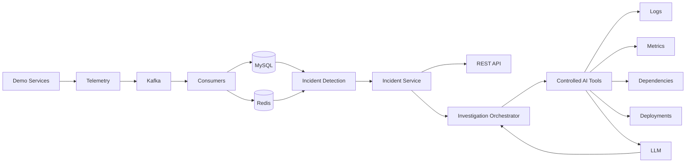

# RCAI

**AI-powered production incident investigation and root-cause analysis platform.**

RCAI is a backend-focused reliability platform that collects production telemetry, detects abnormal behavior, correlates related signals, and uses controlled AI tools to investigate incidents using evidence from logs, metrics, deployments, and service dependencies.

## Problem

When a production service starts failing, engineers often need to investigate multiple sources of information:

* Application logs
* Metrics
* Service dependencies
* Recent deployments
* Historical incidents
* Infrastructure events

RCAI brings these signals together and provides an evidence-based investigation workflow.

## Core Use Cases

### 1. Detect production incidents

RCAI monitors service telemetry and detects abnormal conditions such as:

* Increased error rates
* High latency
* Dependency failures
* Consumer lag
* Traffic anomalies

### 2. Correlate incident evidence

When an incident is detected, RCAI builds a timeline by correlating:

* Logs
* Metrics
* Deployments
* Dependencies
* Related service activity

### 3. Investigate incidents using AI

An AI investigation agent can use controlled, read-only tools to retrieve relevant evidence and produce:

* Incident summary
* Root-cause hypothesis
* Supporting evidence
* Alternative hypotheses
* Recommended checks
* Confidence level

The AI is not given unrestricted database access. It can only use explicitly defined investigation tools.

## Architecture

## Technology Stack

* Java
* Spring Boot
* MySQL
* REST APIs
* Apache Kafka
* Redis
* Docker / Docker Compose
* Linux
* Git / GitHub
* LLM API
* AI tool/function calling

## Reliability Principles

RCAI is designed around several engineering principles:

* MySQL is the persistent source of truth.
* Redis is used for hot and temporary state.
* Kafka provides asynchronous telemetry processing.
* Incident detection works deterministically without depending on AI.
* AI investigations are evidence-grounded.
* AI tools are explicitly controlled and read-only.
* Logs and telemetry are treated as untrusted input.
* Failed events can be retried and routed to a dead-letter queue.
* Duplicate events should not create duplicate incidents.

## Project Scope

RCAI will initially simulate a small production environment containing services such as:

* Payment Service
* Order Service
* Inventory Service

The services will generate realistic telemetry and support controlled failure scenarios so the complete incident lifecycle can be tested locally.

## Non-Goals

This project will not initially attempt to build:

* A full monitoring product
* A Kubernetes platform
* A custom machine-learning model
* A custom LLM
* A multi-agent AI system
* A complex frontend
* A production-scale cloud infrastructure

The focus is on **backend engineering, distributed systems, reliability, and responsible AI-assisted investigation**.

## Project Status

🚧 **Under active development**

The project is being built incrementally, starting with the backend foundation and progressing toward Kafka-based telemetry processing, incident detection, and AI-powered investigation.
